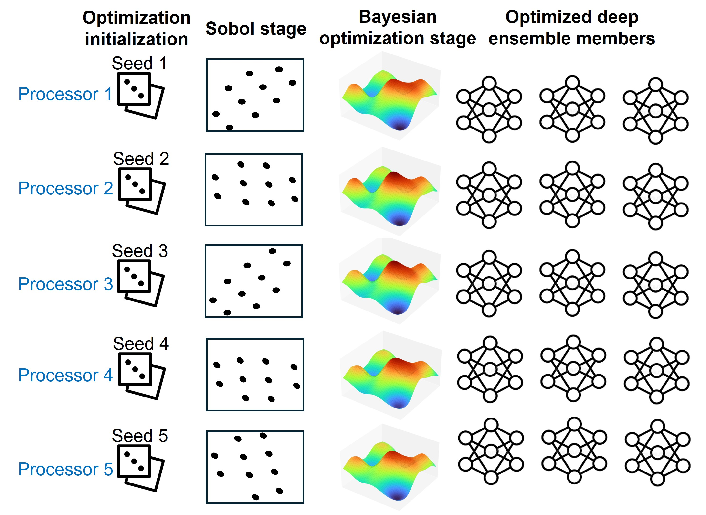

## Introduction
This work introduces a framework for optimizing deep ensmebles using Bayesian optimization, and Sobol sequence to build the prior distribution. The approach is scalable and could be applied to any type of neural networks. The current implementation include a test case on a Densely Connected Convolution Neural Network (DCNN) and a Multi-Layer Perception (MLP) neural network.  The DCNN is trained on computational data, and noise is introduced to the data to asses the method performance on noisy data. The MLP is trained on experimental data.  

## Problem statement
When DEs are not adequately optimized or constructed using a fixed DNN architecture and only varied through random weight and bias initializations, their performance may degrade for highly nonlinear or high-dimensional problems.
To enhance the performance of DEs, different post-hoc calibration methods, are applied after the ensmble is trained, are suggested such as temperature scaling, isotonic regression. This approach despite it improves
the prediction, it wouldn’t improve the internal predictive structure of the models and thus wouldn’t lead to best UQ and accuracy. Recent research has emphasized the integration of optimization techniques to systematically
enhance both predictive accuracy and uncertainty quantification performance. Optimizing multiple deep neural network is expensive, that's why a framework for conducting the optimization is needed. 

We adopt several efficiency-enhancing strategies: utilizing a Sobol sequence to initialize the BO search space, leveraging parallel computing to optimize each ensemble member on a separate processor, 
conducting optimization on a representative smaller dataset, reducing hyperparameter dimensionality, constraining hyperparameter bounds based on prior knowledge, fixing the number of neural network training iterations, 
and limiting the number of optimization iterations.

## Methodology

  
   <em>Optimization strategy: Sobol initialization followed by Bayesian optimization.</em>

We integrate **deep ensembles** with **Bayesian optimization** to (1) reduce **epistemic** uncertainty by selecting diverse yet high-performing neural networks, (2) calibrate **aleatoric** variance predicted by each model, and (3) minimize prediction error on unseen data. Hyperparameter search is performed with the **Ax platform** (PyTorch-based; uses **BoTorch** under the hood).

We optimize the **Root Mean Square Error (RMSE)** on a validation split. Although negative log-likelihood (NLL) could also be minimized, RMSE provides a simpler surface because it avoids balancing mean-squared error against predicted variance terms.

**Optimization strategy**

1. **Sobol initialization.**  
   A deterministic Sobol sequence uniformly samples the search space, yielding diverse initial configurations that act as priors for the Gaussian-process (GP) surrogate used in Bayesian optimization.

2. **Bayesian optimization.**  
   The GP surrogate is iteratively updated; new configurations are proposed (via acquisition functions), evaluated, and fed back to refine the surrogate.

To promote exploration, we run **five** independent optimizations in parallel with different random seeds. While Sobol is deterministic, the seed affects scrambling/randomization, encouraging each run to explore distinct regions. Consequently, the five GP surrogates capture different local behaviors and enrich the candidate set.

From all runs, we select the **top fifteen** models (by RMSE) to form the **deep ensemble**—a size chosen empirically for strong performance with diminishing returns beyond this point.

**Data & hyperparameters**

- **Splits:** train (fit), validation (optimize), held-out test (report).  
- **Search space (examples):** learning rate, dropout rate, activation function, and architecture-specific hyperparameters.

